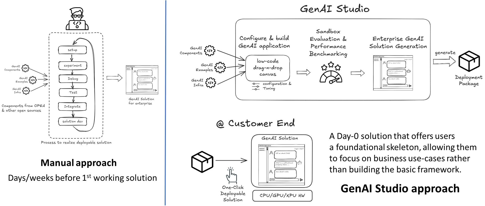
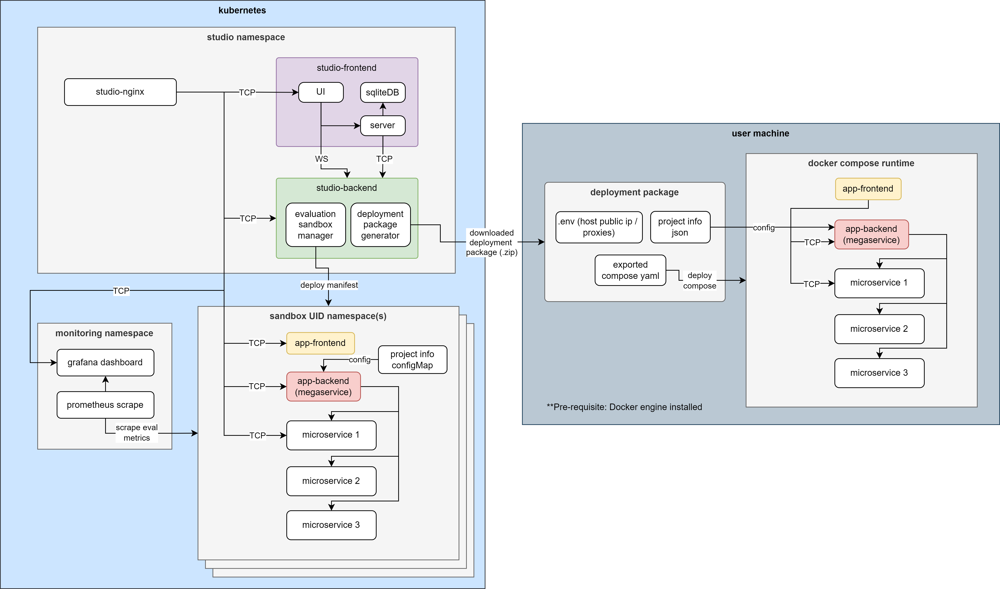

# Generative AI Studio (GenAIStudio)
 GenAI Studio is designed to streamline the creation of custom large language model (LLM) applications. It builds on insights gained from playground experiments, allowing developers to easily build, test, and benchmark their LLM solutions through an intuitive no-code/low-code interface.

 ## Reduce Barrier of Adoption with Low-Code: End-to-End GenAI App Development for Productivity
 GenAI Studio reduces the need for manual scripting by encapsulating microservices from OPEA's [GenAIComps](https://github.com/opea-project/GenAIComps) into easily configurable UI blocks. Combined with OPEA's [GenAIInfra](https://github.com/opea-project/GenAIInfra), it generates a one-click deployable package. This approach accelerates the proof-of-concept (POC) process for AI engineers, allowing them to focus on experimentation without the overhead of constructing RAG pipelines or managing infrastructure manually.

 **🌟Key Highlights**
 - 🛠️ Build & configure GenAI apps rapidly with low-code with no setup hassle
 - 🔍 Instant evaluation with sandbox
 - 📊 Dynamic performance measurement & benchmarking
 - ⚙️ One-Click deployment package generation for instant app setup



 ## Key Components


 ### Kubernetes Cluster
 The Kubernetes cluster hosts both the Studio, Sandbox and Monitoring namespaces. 
 - **Studio Namespace:** This is the core application namespace containing the Studio AppBuilder UI and Studio server. The UI allows users to manage projects and build GenAI pipelines. The server includes the Evaluation Sandbox Manager and Deployment Package Generator, which handle deployment of user-designed pipelines.
 - **Sandbox Namespace(s):** Managed by the Studio server, these namespaces create sandbox environments where users can test and evaluate their pipelines. 
 - **Monitoring Namespace:** This namespace contains a Prometheus service that collects performance data from each sandbox. The collected metrics are visualized in a Grafana dashboard, enabling users to monitor resource utilization and pipeline performance.

### Studio UI
The Studio UI has two main pages.
- **Main Page:** Provides an overview of the project list, allowing users to easily manage projects, launch sandboxes, download deployment packages, or manage package manifests.
- **Canvas Page:** A drag-and-drop interface built on Flowise, enabling usersto build proof-of-concept (POC) applications by assembling various configurable microservice blocks into a GenAI pipeline. These microservices form the core components necessary for creating Retrieval-Augmented Generation (RAG) applications. The pipeline can be run and tested within the Studio’s Sandbox environment.

### Sandbox
A sandbox is launched when a user  a project through the Studio UI. Each sandbox runs independently, allowing for performance testing and monitoring. The sandbox namespace, managed by the Studio server, contains the necessary microservices based on the pipeline design and includes a App UI. Users can test the pipeline's inference performance and track resource utilization via an integrated Grafana dashboard.

### GenAI Microservices
GenAIStudio currently supports a subset of microservices from GenAIComps, including [DataPrep with Redis](https://github.com/opea-project/GenAIComps/tree/main/comps/dataprep/redis), [TEI Embedding](https://github.com/opea-project/GenAIComps/tree/main/comps/embeddings), [Retriever with Redis](https://github.com/opea-project/GenAIComps/tree/main/comps/retrievers/redis), [Reranks](https://github.com/opea-project/GenAIComps/tree/main/comps/reranks), [LLMs](https://github.com/opea-project/GenAIComps/tree/main/comps/llms) and [Guardrails](https://github.com/opea-project/GenAIComps/tree/main/comps/guardrails). This list is expected to grow in future releases, expanding the range of services available for building and testing GenAI pipelines.

### Deployment Package
Users can download the deployment package in a ZIP file from the Studio UI and deploy it locally using Docker Compose. This local setup mirrors the sandbox environment, providing the same app configuration and microservices. It enables users to test their GenAI application on their local machine with identical infrastructure.

## Setting up GenAIStudio
### Who needs to set up the Studio?
  
If you're part of a team and want to provide a testing playground for your members, you'll need to set up GenAIStudio. This setup allows your team members to test and evaluate their pipelines in a sandbox environment without worrying about infrastructure management.

However, if you already have access to an existing Studio instance, you can skip the setup process and move directly to the next section to begin working with your projects.

### Currently Known Limitations
- Having more than one same microservice node is not allowed. The sandbox execution of a workflow with more than one same microservice node will fail.

### System Requirements
```
Memory: >64GiB (To run a ChatQnA Sandbox, approx. 45GiB memory is needed)
Storage: >100GiB
OS: Linux Debian-based distribution
```
_Note: This setup has been validated on a system running Ubuntu 22.04 on an Intel(R) Xeon(R) Platinum 8468 server with 1000GB memory and 300GB local storage._

### Installation
1. **First, clone this repo to your server.**
	```
	git clone https://github.com/opea-project/GenAIStudio
	cd GenAIStudio
	```
2. **Kubernetes Cluster Requirement**
   
	GenAIStudio requires an on-premise Kubernetes cluster. If your server does not have Kubernetes set up, please follow this [guide](../opea_studio/setup-scripts/setup-onpremise-kubernetes/readme.md) to install and configure one.
	
 3. **Studio Setup**
	Once Kubernetes is ready, follow this [studio setup guide](./setup-scripts/setup-genai-studio/readme.md) to configure GenAIStudio.

### Getting Started with GenAIStudio 

You can access the the Studio UI in a web browser at `http://localhost:30007`.
 
#### Start a New Project
1. **Create a new workflow:** 

	On the `Main Page`, click **Create New Workflow**. This will open a blank `Canvas Page` where you can start building your new project.

	

2. **Drag-and-drop microservice nodes:** 

	In the top-left corner of the canvas, click the ➕ **Add Nodes** button to view a dropdown list of available microservice nodes. You can expand each category and drag nodes onto the canvas. Use your mouse scroll to zoom in and out of the canvas for easier navigation.

	

3. **Configure and connect microservice nodes:** 

	Some nodes have configurable parameters that let you set specific settings. After configuring a node, you can connect it to another node by dragging the output edge and dropping it onto the input edge of the target node. Once your workflow is complete, click the 💾 **Save OpeaFlow** button to save your project.

	

4. **Run a Sandbox:** 

	Back on the **Main Page**, you’ll see the saved workflow under the Workflow list. Click the ▶️ **Start button** to initiate the sandbox environment for your workflow. Please allow 3-5 minutes for the environment to be fully set up. Once ready, you can test the workflow in the Sandbox App UI and monitor resource usage through the Grafana Dashboard.

	

#### App UI Features
1. **Conversational Interactions with Custom Settings**

	Engage in a conversation with the chatbot using various parameter settings. The chatbot’s responses will be tailored based on the content in the uploaded data sources.

	

2. **Upload Data Sources.**

	Add data sources by uploading files (supported file types: .pdf, .docx, and .txt) or by inserting multiple URLs to online articles.

	

#### Monitor Sandbox Resource Utilization in Grafana Dashboard
- View real-time resource utilization metrics for the Sandbox environment. CPU and memory usage are tracked and visualized in the Grafana dashboard for easy monitoring.

	

### Download and Run GenAI App Deployment Package Locally	
#### Prerequisites
To deploy the downloaded GenAI application locally, ensure that Docker Engine with Docker Compose are installed on your machine. If you haven't installed them yet, please refer to the official [Docker](https://docs.docker.com/engine/install/) documentation for setup instructions.
	
#### Deploying a GenAI Application
The downloaded zip file contains the necessary settings for the microservices. Please follow this [guide](./studio-backend/app/templates/readmes/compose-readme.MD) to deploy a GenAI app created and downloaded from the studio the studio.

## Import and run a sample project
To get you onboard quickly on the Studio UI, you can import and run this sample project.


